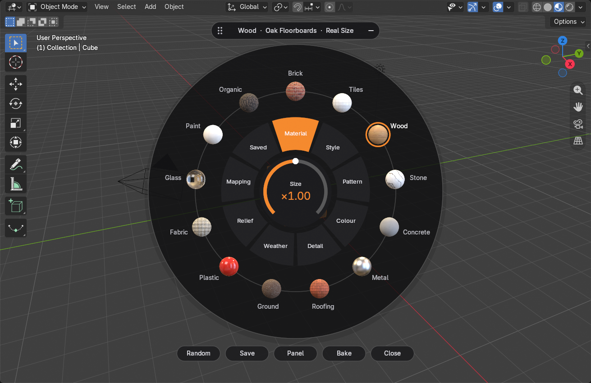
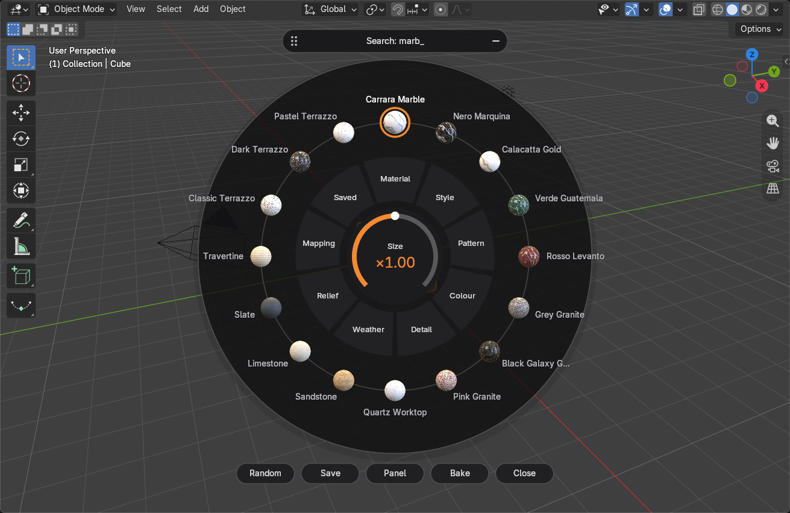
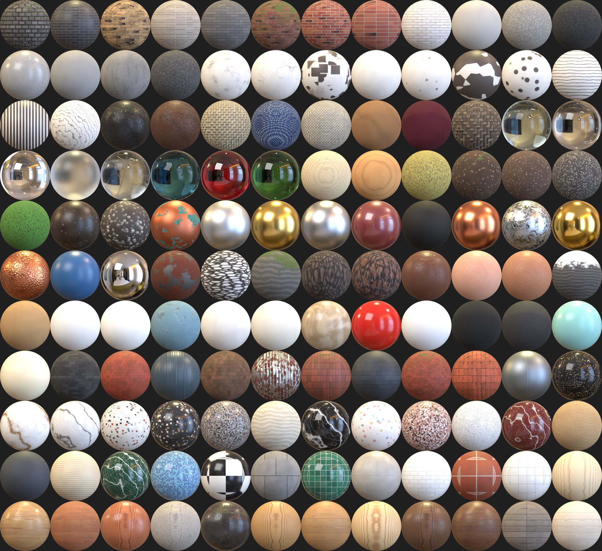

# Procedural Palette

**Free, open source procedural materials for Blender.** Pick a style from a
radial dial, tweak a few sliders, add weathering, and bake to textures when you
need game-ready maps.

- No image textures: every material is built from standard Blender shader nodes.
- `.blend` files stay small.
- Materials still render without the add-on installed.



| Search while hovering the dial | Every style has a preview |
|---|---|
|  |  |

## Features

- **Viewport dial** (Shift+Alt+M): a radial picker drawn right in the 3D Viewport.
  - Page ring: Material, Style, Pattern, Colour, Detail, Weather, Relief,
    Mapping and Saved.
  - Outer ring: thumbnail balls, colour swatches, and parameters with value arcs.
  - Centre knob: drag it (Shift for fine control) or scroll to change the
    current value.
  - Type while hovering to search all styles.
  - Drag the header to move the dial, Ctrl+scroll to resize it, or press
    "–" to minimise it.
  - Clicks outside the dial still reach the viewport.
- **122 one-click styles in 13 families**:
  - Brick and tiles.
  - Wood (planks and solid).
  - Stone and marble; concrete and asphalt.
  - Metal and roofing.
  - Ground.
  - Plastic and rubber; fabric and leather.
  - Glass, water and ice.
  - Paint, plaster and paper.
  - Organic: bark, skin, mossy and snowy rock.
- **Real-world scale**: 20 pattern generators sized in metres. A brick is a
  real 215 × 65 mm brick.
- **Weathering where it belongs**:
  - Edge wear and chips on convex edges.
  - Rust.
  - Dirt in cavities and grime streaks.
  - Moss on top faces and in crevices.
  - Dust and snow.
  - Wetness and puddles.
- **Detail overlays**: cracks, veins, spots, stripes, pores, speckle, strata,
  clouds and crystals.
- **Real Depth**: one toggle switches from bump to true displacement.
- **No UVs needed**: planar patterns are box-projected automatically. You can
  also use Stretch with Object, World Space or UV mapping.
- **Random variations**, **Simple / Advanced** controls, and
  **Draft / Balanced / Final** quality levels.
- **Library**: save looks and reuse them in any project, or mark materials as
  assets to share with a team.
- **Baking** (Cycles), from 512 px up to 8K:
  - Maps: base colour, roughness, metallic, normal, height, AO and an ORM pack.
  - Works with several materials on one object.
  - Existing UVs are never changed.
- **Safe updates**: materials made with older versions are upgraded
  automatically when you open the file, keeping your settings.

## Requirements

Blender 4.2 or newer (tested on 5.2 LTS). Cycles or EEVEE. Windows, macOS or Linux.

## Install

1. Download `procedural_palette-x.y.z.zip` from the
   [Releases](../../releases) page. Don't unzip it.
2. In Blender, go to *Edit → Preferences → Get Extensions*, open the **⌄** menu
   at the top right, choose **Install from Disk…**, and pick the zip.

## Use

- **Shift+Alt+M** in the 3D Viewport opens the dial. You can also click
  *Open Dial* in the sidebar.
- The full panel is in **Sidebar (N) → Palette** and in *Material Properties
  → Procedural Palette*.
- Apply buttons:
  - **Apply** changes the active Palette material in place.
  - **New** creates a separate material.
  - **Make Unique** splits off a material that several objects share before
    you edit it.
- The controls live on three group nodes in the material (`PP Surface`,
  `PP Detail` and `PP Finish`), so you can also edit them in the Shader Editor.
- If materials look broken after updating from 0.1.x, open
  *Library → Repair Palette Materials*.

## How it works

```
Texture Coordinate ─► object scale ─► Mapping ─► PP Surface (pattern group)
                                                    │
                                     PP Detail (optional overlay)
                                                    │
                                     PP Finish (weathering + displacement)
                                                    │
                                        Principled BSDF ─► Material Output
```

- Every pattern group has the same outputs: Color, Roughness, Metallic, Height,
  Transmission, Coat, Sheen, Subsurface and IOR.
- Height runs from 0 to 1, where 1 is the outer surface. Displacement uses a
  mid-level of 1, so it only ever pushes inward.

## Limitations

- **Edge wear** is strongest in Cycles. EEVEE only gets the occlusion-based
  part of the edge detection.
- **Real Size mapping** stores the object's scale when the material is applied.
  After rescaling an object, press *Mapping → Sync Object Scale*.
- **Wood grain** runs along the object's X axis and bark furrows along Z.
  Neither follows curved geometry yet.

## Contributing

Bug reports, new patterns and styles are welcome. See
[CONTRIBUTING.md](CONTRIBUTING.md) for the project layout, how to run the
tests, and how to add a pattern.

## License

[GPL-3.0-or-later](LICENSE). Procedural Palette is an independent project and is
not affiliated with any commercial add-on.
